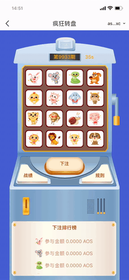

# Animal picking

As a privacy public blockchain, AOS is the world’s fastest blockchain that supports smart contracts and allows users to issue their own confidential assets; AOS is also the world’s first public blockchain that supports zero-knowledge-proof programming, thus earning a nickname of “privacy-based dapp platform”.

AOS ushers in a new age of privacy blockchain 3.0. Compared with privacy coins such as Monero, ZCash, Dash, AOS allows users to issue their own confidential assets and has achieved Turing complete as for the issuance of confidential assets. In comparison to other smart contract platforms that protect privacy, AOS has made an invention in zero-knowledge-proof programming and has achieved Turing completion in privacy application programming. In other words, AOS gives users an easy and convenient way to develop their own privacy applications.

## Example

