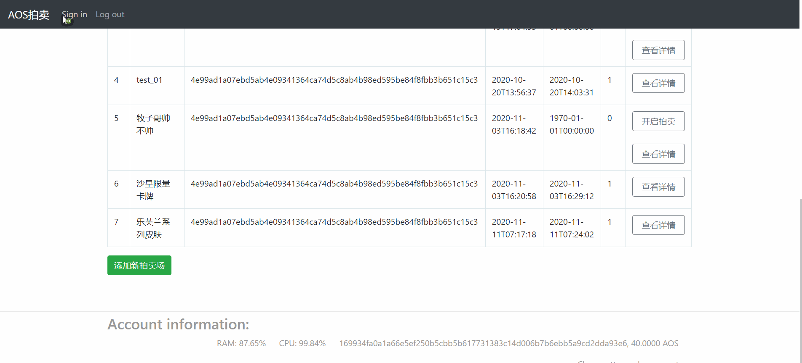

# 基于AOS的匿名拍卖系统

## 0 项目特性

- **智能合约函数、事件、结构等设计规范性、合理性、执行效率与安全性**

- **代码编写简洁规范、可读性强，注释清晰准确**

- **智能合约创意新颖、设计巧妙和通用性强**

- **多底层框架版本**

## 1 AOS 介绍

AOS是全球范围内性能最强的支持智能合约的隐私公链，支持用户发行隐私代币，被称为“隐私版的EOS”；AOS也是全球首个支持零知识证明编程的隐私公链，也被称为“隐私版的小程序开发平台”。

AOS开创和引领隐私区块链3.0时代，相较于Monero、ZCash、Dash等隐私货币，AOS支持用户自主发行隐私资产，实现了隐私资产发行层面的图灵完备。相较于其他普通的隐私智能合约平台，AOS首创性的支持零知识证明编程，实现了隐私应用编程层面的图灵完备，即支持用户轻松便捷的自主开发隐私应用。

## 2 项目概述

### 2.1 用户群体分析

需要通过拍卖来售卖东西的用户以及有匿名拍卖物品需求的用户。

### 2.2 用途概述及隐私性

匿名拍卖在我们的生活中有着重要的需求。线上拍卖系统具有环保、效率高等特,因此线上拍卖系统被广泛使用。但是,现有的线上拍卖系统依然存在一些不容忽视的问题。比如现有的拍卖系统均建设在中心化服务器上，无法保证公正也不透明，且一旦被黑客攻破中心服务器，那么拍卖者的隐私信息以及拍卖数据都有可能遭到恶意的泄露与修改。而区块链具有去中心化、数据不可篡改、安全可信的特点,数据一旦存入区块链就无法篡改。区块链是不可篡改、真实可信的数据库,因此区块链技术正是保证线上拍卖系统公正性和安全性的最佳方案。并且拍卖的一切信息均会加密后输出至前端，保证了页面公开展示拍卖时的隐私。

## 3 接口分析及数据要求

- **addsite**

  **功能**：新建一个拍卖场

  **参数：** account_name, site_name

  | 变量名 | 类型  |        含义         |
  | :----: | :--: | :-----------------: |
  | account_name  | account | 调用该action的人  |
  |   site_name  | string | 拍卖场名称 |

- **startbid**

  **功能**：开启拍卖场

  **参数：** account_name, site_key

  | 变量名 | 类型  |        含义         |
  | :----: | :--: | :-----------------: |
  | account_name  | account | 调用该action的人  |
  |   site_key  | uint64_t | 拍卖场ID |

- **addgoods**

  **功能**：添加新的拍卖品

  **参数：** account_name,site_key,goods_name

  | 变量名 | 类型  |        含义         |
  | :----: | :--: | :-----------------: |
  | account_name  | account | 调用该action的人  |
  |   site_key  | uint64_t | 拍卖场ID |
  |   goods_name  | string | 物品名称 |

- **bidgoods**

  **功能**：竞拍某物品

  **参数：** account_name, goods_key

  | 变量名 | 类型  |        含义         |
  | :----: | :--: | :-----------------: |
  | account_name  | account | 调用该action的人  |
  |  goods_key  | uint64_t | 物品ID |

## 4 使用范例

 添加并开启一个拍卖场，启动拍卖场，并使用另一个账号进行竞拍

## 6 总结与未来计划

- **改进合约里的匿名性实现，扩展拍卖的功能**
- **增加适配各种场景的客户端，如手机端**

